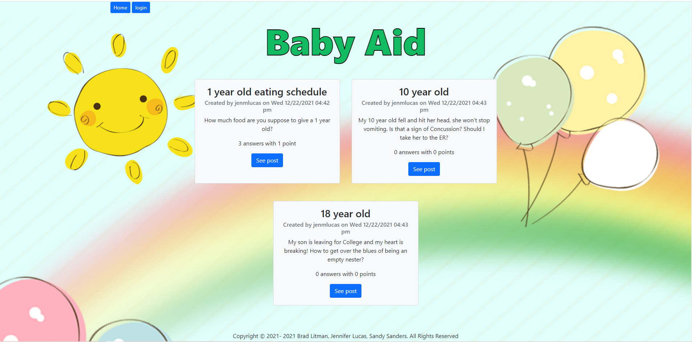

# Baby-Aid

## Description
Baby Aid was created to allow parents with children newly born to 18, be able to have a safe environment to ask questions and receive answers from other experienced parents. Not everyone has a support system around them that allows for the ability to get help if needed. In order to use the site you must create an account. Once created you are then able to post questions and respond with answers to other parents questions. You are also able to vote on both the question and answer, which allows users to know which questions are the most common and which answers are the best solutions to the questions.

## Table of Contents (Optional)
* [Installation](#installation)
* [Usage](#usage)
* [License](#license)
* [Contributing](#contributing)
* [Test](#test)
* [Questions](#questions)

## Installation
Clone the repo, then do "npm install". Create a new .env file with your own information. Then open your Mysql and run "source db/schema.sql" once successful, run "quit". Then run "npm start" and the website will be deployed on your local server. From here you can make changes or push straight to Heroku for a working website hosted through Heroku.

## Usage
This is what it will look like on your device.

[Baby Aid Production Link](https://calm-fortress-46248.herokuapp.com/)

## License
N/A

## Contributing
Brad Litman [Github](https://github.com/Blitman12), email bradlitman94@gmail.com,

Jennifer Lucas [Github](https://github.com/jenmlucas), email jenmlucas1@gmail.com,

Sandy Sanders [Github](https://github.com/sandy-06), email Sandy-sanders@msn.com.

## Tests
N/A

## Questions
Please checkout our Github's above for other projects we have worked on. If you have any questions or concerns, feel free to email one of us above. Thank you.